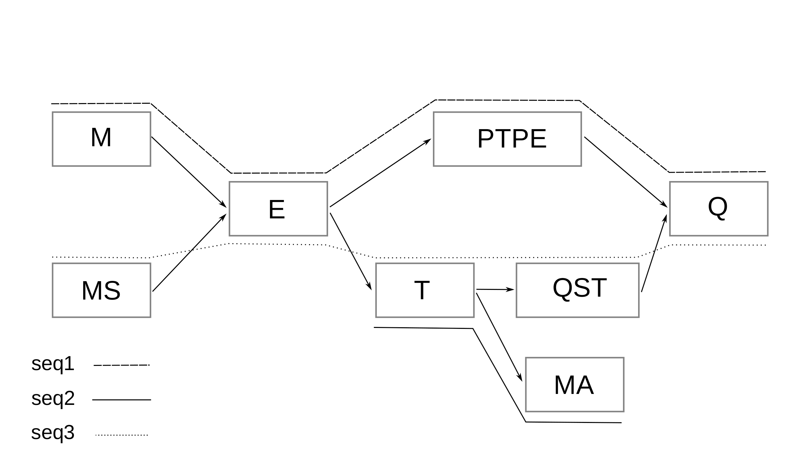

# MSA to GFA
Is a tool to turn MSA to GFA v1 with embedded paths corrisponding to groups original sequences. Results can be then visualized with [gfaviz](https://github.com/ggonnella/gfaviz), 
or [bandage](https://rrwick.github.io/Bandage/) or any other avialble GFA visualization tools out there.

The tool is split into two separate steps, building the graph, and adding the paths.

## Global optional arguments
Before supplying one of the subcommands, the tool takes two general arguments
```
usage: test_main.py [-h] [--log LOG_FILE] [--dir OUTDIR] {build_graph,add_paths} ...

Build GFA v1 from MSA

Subcommands:
  {build_graph,add_paths}
                        Available subcommands
    build_graph         Command for building the GFA from a given MSA
    add_paths           Add paths to the graph that was built

optional arguments:
  -h, --help            show this help message and exit
  --log LOG_FILE        Log file name/path. Default = out_log.log
  --dir OUTDIR          Output directory where to put the output files, default: .

```
- `--log` name of out log file, default is `log_file.log`
- `--dir` output directory for outputs, if this is specified then you don't need to specify full path for outputs, just the name of file and this directory path will be used.

## Building the Graph
The following options are available for this step when calling `msa_to_gfa biuld_graph` subcommand:
```
usage: test_main.py build_graph [-h] [-f MSA_PATH] [--compact] [-o OUT_GFA] [-n SEQ_NAMES]
                                [-c COLORS]

optional arguments:
  -h, --help            show this help message and exit
  -f MSA_PATH, --in_msa MSA_PATH
                        Input MSA in FASTA format
  --compact             If this give, the graph will be compacted before writing
  -o OUT_GFA, --out OUT_GFA
                        Output GFA name/path
  -n SEQ_NAMES, --seq_name_tsv SEQ_NAMES
                        A tsv with two columns, first is sequence names, second is a shortened or
                        abbreviated name
  -c COLORS, --nodes_info COLORS
                        Output JSON file with nodes information


```
Required arguments here are:
- `-f, --in_msa` for input MSA in FASTA format
- `-o, --out` the name of the output graph file, if `--dir` is specified, then you do not need to give the full path, just a name and the directory you gave will be used.

Other arguments:
- `--compact` which is recommended to compact linear stretches of nodes in the graph
- `-n, --seq_name_tsv` which is a TSV file with two columns, first column is the original fasta sequence ids without the ">" character, and the second column is a shorter name for the same sequences, in case the user wants to use abbreviations or a smaller sequence ids for the sequences. E.g:
We have the following 3 amino acid sequences:
```
>seq1
-MEPTPEQ
>seq2
---T--MA
>seq3
MSETQSTQ
```
The TSV file you can provide would be:
```
seq1    s1
seq2    s2
seq3    s3
```
- The option `-c, --nodes_info` will output a json file with information related to the nodes: node id, node sequence, and the sequences associated with that node.
highly conserved regions will have nodes with many colors.
  
When running the first subcommand, you'll automatically get a JSON file containing the path and grouped paths informatin, this file is needed for the second step.
The graph of the previous sequences would look like


## Adding paths
The JSON file outputted along with the GFA file has information related to each sequencs and its path in the graph, as well, groupings of sequences that have the same path in the graph.
The following options are available with this subcommand:
```
usage: test_main.py add_paths [-h] [-g GFA] [--in_groups IN_GROUPS] [--all_groups]
                              [--some_groups SOME_GROUPS]

optional arguments:
  -h, --help            show this help message and exit
  -g GFA, --gfa GFA     input graph to add paths to
  --in_groups IN_GROUPS
                        the groups json file
  --all_groups          Adds all paths to the GFA file given
  --some_groups SOME_GROUPS
                        adds only the specified paths

```
Required arguments:
- `-g, --gfa` is GFA file from the first step
- `--in_groups` is the JSON file outputted along with the GFA file in the first step
Optional arguments:
-  `--all_groups` all groups are added to the graph as paths
-  `--some_groups` user need to give a text file with one group or sequence name on each line, if abbreviated names were used in the first step, then the abbreviations need to be used
